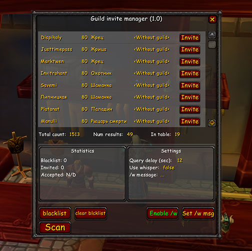
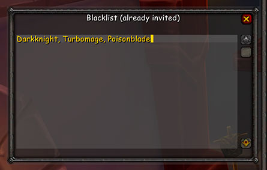
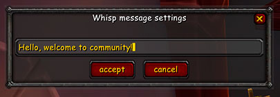

# GuildInviteHepler

## Game version
3.3.X

## Open settings
```
/gim
```

## Description
It's a simple extension for help you send guild invites. Some servers may restrict multiple queries for preventing spam. Addon uses delay between invites and it's safe for anti-spam systems.


## Blacklist
After you send invite to any player, he does added in blacklist and filtered in next scans.


You can clear blacklist for return filtered players in scan results.

## Whisp message
Along with the invitation, you can send a private message.

Just press [`set /w msg`] button and write new message.


This feature can be enabled/disabled if you want (by pressing [`enable /w`] button). Current status shows in "settings" block (use whisper: true/false).

## Custom filters
As i say addon uses `/who` list for scanning. By default it apply `80-80`.

If you want custom filter just use `/who` command and write you own in window (like `c-"Priest"` or `70-75`). Addon will automatically get the results.